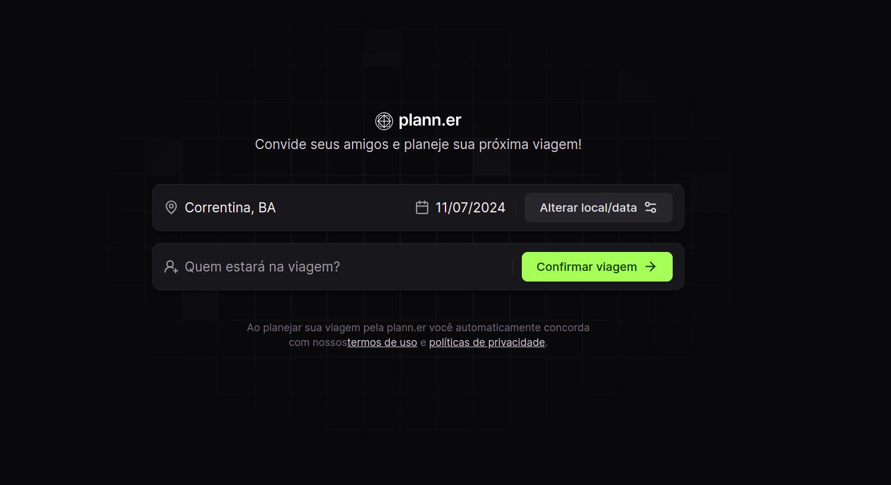

# Planner 

## Sobre

Planner é um projeto de agendamento de viagens, onde o usuario pode adicionar os participantes, o lugar de destino e o dia da viajem. Ideal para planejar roteiro de viajens seja sozinho ou em grupo.

## Tecnologias

## Índice

- [Planner ](#planner-)
  - [Sobre](#sobre)
  - [Tecnologias](#tecnologias)
  - [Índice](#índice)
  - [Fotos](#fotos)
  - [Instalação](#instalação)
  - [Contatos](#contatos)
- 

## Fotos

## Instalação

- **Instalação**
  - npm install
- **Rodando o app**
  - npm run dev

## Contatos

#
